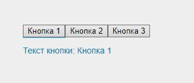
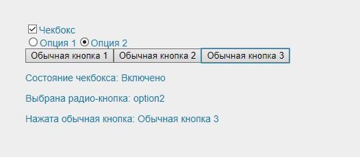
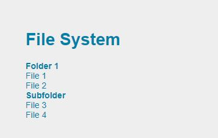
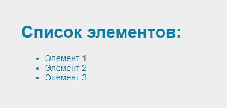
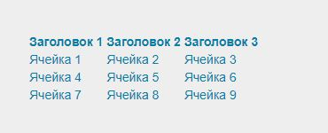
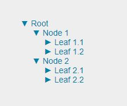
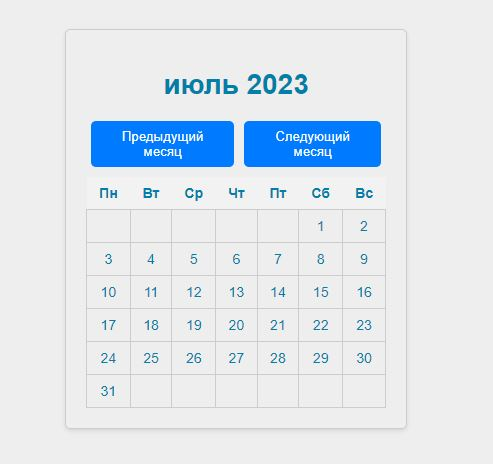
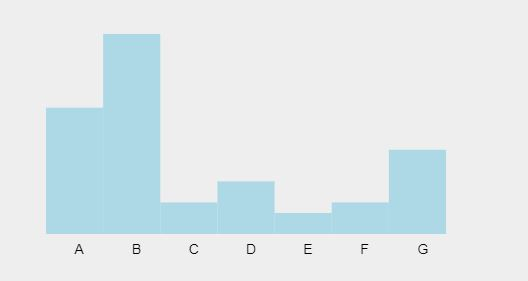
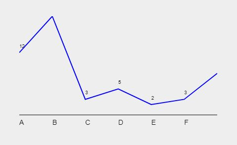
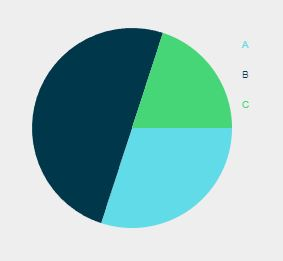

# ReactExamplesComponents
Различные примеры использования компонентов

Используете Babel для компиляции.


```script
    <script src="https://unpkg.com/react@16/umd/react.development.js"></script>
    <script src="https://unpkg.com/react-dom@16/umd/react-dom.development.js"></script>
    <script src="https://unpkg.com/babel-standalone@6.15.0/babel.min.js"></script>
```
### Примеры

- button.html

    <p align="center"></p>

- element.html

	<p align="center"></p>

- filemodel.html

	<p align="center"></p>

- listview.html

	<p align="center"></p>

- table.html

	<p align="center"></p>

- treeview.html

	<p align="center"></p>

- calendar.html

	<p align="center"></p>

- simple_chart.html

   <p align="center"></p>

-  line_chart.html

	<p align="center"></p>

- pie_chart.html

	<p align="center"></p>